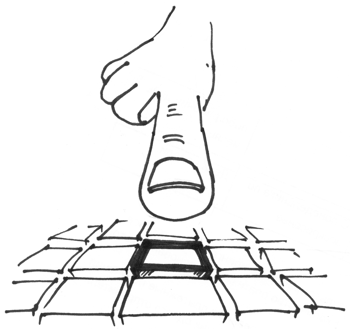

=================
 Getting started
=================

Let’s create your first Spectre application. Create a folder where you’ll keep all your app files::

  demo_app/
    fan/
    static/
    templates/    
    build.fan

The only thing mandatory here is the ``build.fan`` file, it must exists in the root folder of your app. Everything else may be changed to better fit your needs.

In ``build.fan``, specify dependency on Spectre v.0.8::
    
    using build
    class Build : build::BuildPod {
      new make() {
        podName = "demo_app"
        summary = ""
        srcDirs = [`fan/`]
        depends = ["sys 1.0", "spectre 0.8"]
      }
    }

In ``fan/`` create your root application’s class::

  using spectre

  class DemoApp : Settings {
    new make(File appDir) : super() {
    
    }  
  }
  
You’ll need one and only one :class:`Settings` implementation in your app, it will be used as a root of your application. For application to work, you set :attr:`Settings.root` property to the root :class:`Turtle` of your application.

To add routes we create :class:`Router` class and pass a list of ``[route path, view method]`` tuples to it::

  using spectre

  class DemoApp : Settings {
    new make(File appDir) : super() {
      routes := Router {
        ["/", IndexView#index],
      }
      
      root = Handler500().wrap(
               Handler404().wrap(
                 routes
               )
             )
    }
  }
  
Also we’ve added two error barriers (:class:`Handler500`, :class:`Handler404`) which will catch errors in our app and show error messages to user explaning what happened. As you can see, our router is wrapped by this barriers, so all the errors in the router will be captured and processed properly. It’s recommended to set these barriers as top-level middlewares of your app.

Our route still points at an unimplemented class method (view). To implement it, we just create a class with ``index`` method returning :class:`Res`::

  class IndexView {
    Res index() {
      return Res("<html><body><h1>Hello from the other world!</h1>"
      + "<a href='/items/'>List of items</a></body></html>")
    }
  }

Now you can run::

  >>> fan spectre::WispServer path/to/demo_app/

and point your browser at `<http://localhost:8080/>`_. You should see your hello message. Relax, take a cup of coffee, take a deep breath. We’re just in the beginning.

What we’ve done is the simplest possible way to implement view: just return :class:`Res` instance with all the content of html page. However, we are not using any power of templates at all. Let’s fix that in :class:`ItemsView`::

  class ItemsView {
    [Str:Obj][] items() {
      [["id": 1, "name": "Item 1"],
       ["id": 2, "name": "Item 2"],
       ["id": 3, "name": "Item 3"]]
    }
  
    TemplateRes list() {
      return TemplateRes("items_list.html", ["items": items])
    }
  }
  
By returning :class:`TemplateRes`, we are sending data obtained in view (``items``) to be rendered in :attr:`~TemplateRes.template` ``items_list.html`` with :attr:`~TemplateRes.context` ``["items": items]``. Let’s create ``items_list.html`` template in ``templates`` folder::

  <html> 
    <body>
      <h1>Items:</h1>
      <ul>
        {{#items}}
          <li><a href="/items/{{id}}/">{{name}}</a></li>
        {{/items}}
      </ul>
    
        
      <a href="/">← Return to main page</a>
    </body>
  </html>

Syntax used here is the "mustache" template language. You can find a really short introduction to musatche syntax `on their website <http://mustache.github.com/mustache.5.html>`_.

For this template to work, we should wrap routes with :class:`MustacheRenderer`. :class:`TemplateRes` will then be properly intercepted and rendered. Add this to :class:`DemoApp` constructor::

  tempalteRenderer := MustacheRenderer { 
    templateDirs = [appDir + `templates/`]
  }

  root = Handler500().wrap(
           Handler404().wrap(
             tempalteRenderer.wrap(
               routes
             )
           )
         )

And don’t forget to add a route to our brand-new :class:`ItemsView` class::

  routes := Router {
    ["/", IndexView#index],
    ["/items/", ItemsView#list],
  }

Switch back to your browser, find a link on the index page and click it. You should be redirected to view we’ve just implemented. Have you noticed that without restarting the server you still could see new changes? That’s a feature, not a bug (see :doc:`devserver` for more details. You also will find out how to put static files into your project — css, js, images. This can make your app much prettier).

But we’re not using any request parameters yet. Let’s fix it by creating a page for individual item. Add a method to :class:`ItemsView`::

  TemplateRes edit(Str itemId) {
    Int _itemId := Int.fromStr(itemId)
    item := items.find { it["id"] as Int == _itemId }
  
    return TemplateRes("item_edit.html", ["id":   item["id"],
                                          "name": item["name"]])
  }

now add a route::

  routes := Router {
    ...
    ["/items/{itemId}/", ItemsView#edit],
  }

``itemId`` parameter will be captured in url and passed to your view as an :class:`Str` argument with the same name. Finally you create a template::
  
  <html> 
    <body>
      <h1>{{name}}</h1>

      <form action="." method="POST">
        <table>
          <tr>
            <td>Id:</td><td>{{id}}</td>
          </tr>
          <tr>
            <td>Name:</td>
            <td><input type="text" name="name" value="{{name}}"/></td>
          </tr>
          <tr>
            <td></td>
            <td>
              
{{message}}

              <input type="submit" value="Save changes"/>
            </td>
          </tr>
        </table>
      </form>
        
      <a href="/items">← Return to items</a>
    </body>
  </html>
  
Now on `<http://localhost:8080/items/1/>`_ you should see a form, but the button doesn’t work. Let’s change our view a little::

  TemplateRes edit(Str itemId, Req req) {
    Int _itemId := Int.fromStr(itemId)
    item := items.find { it["id"] as Int == _itemId }
  
    Str message := ""
  
    if (req.method == "POST") {
      item["name"] = req.post["name"]
      message = "Item ’" + item["name"] + "’ saved"
    }

    return TemplateRes("item_edit.html", ["id":      item["id"], 
                                          "name":    item["name"],
                                          "message": message])
  }

Here we detect form posting via :attr:`Req.method` attribute, and then access form data through :attr:`Req.post` which is a map-like object containing all POST parameters.

"Save changes" button should work now. If you were watching close enough you’ll see that changes are not actually persisted, but hey, it’s just a demo. You should get the general idea.

Last thing is missing: we should redirect back to page using GET after processing POST request to avoid form reposting on page refresh. Let’s see how we can do this::

  Res edit(Str itemId, Req req) {
    Int _itemId := Int.fromStr(itemId)
    item := items.find { it["id"] as Int == _itemId }
  
    if (req.method == "POST") {
      item["name"] = req.post["name"]
      Str message := "Item ’" + item["name"] + "’ saved"
      return ResRedirect(Uri.fromStr("/items/" + item["id"]
                                   + "/?message=" + Util.urlencode(message)))
    }

    Str message := req.get.get("message", "")

    return TemplateRes("item_edit.html", ["id":      item["id"],
                                          "name":    item["name"],
                                          "message": message])
  }
  
Here we just return :class:`ResRedirect` from view that will issue 302 FOUND http redirect. We also :func:`~Util.encode` message value: if it contains any of ``&``, ``=`` or ``;`` characters they will be backslash-escaped.

Congratulations! You’ve just completed this tutorial and should have basic undestanding of how to build applications with Spectre. You may now continue by reading :doc:`turtles` to get a deeper understanding of how these things actually work. Wish you good luck!