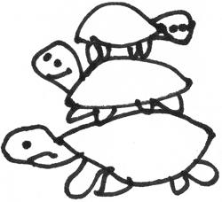

====================
Understanding basics
====================

Turtles all the way down
------------------------

Turtles are unified building blocks of any Spectre application. The name "Turtle" was inspired by Simon Willison’s `article <http://simonwillison.net/2009/May/19/djng/>`_, who originally proposed an idea to unify different parts of Django under common contract.

.. class:: Turtle

   .. function:: Res? dispatch(Req req)

      Process request. Turtles may process request by themselves, skip processing to subsequent turtles or delegate processing to inherited turtles and do some pre/post processing job for them.

   .. function:: plusTurtle(Turtle t)
	
      Combines this and `t` into a :class:`Selector`. Example::
	
        app1Routes := Router([...])
        app2Routes := Router([...])

        routes := app1Routes + app2Routes

Unified contract makes application parts rearrangeable, interchangable, easy to understand and reuse. For now, the following parts are implemented as turtles:

+ top-level error barriers (:class:`Handler500`, :class:`Handler404`);

+ middlewares (e.g. :class:`SessionMiddleware`);

+ :class:`Router`;

+ individual view wrappers;

+ :class:`TemplateRes` processors (template renderers);

+ flow control and grouping turtles (e.g. :class:`Selector`);

+ finally, whole application is just a :class:`Turtle`.

Basic turtles implementations
-----------------------------

.. class:: Selector

   Group a bunch of turtles and choose first that returns not-null :class:`Res`: ::

       Selector([
         turtle1,
         turtle2,
         turtle3
       ])

.. class:: Middleware

   Wrap another :class:`Turtle` and do pre- or post-processing work on :class:`Req`/:class:`Res` objects.

   .. function:: Void before(Req req)

      Is called before invoking child’s :func:`~Turtle.dispatch`.

   .. function:: Res? after(Req req, Res? res)

      Is called after child’s :func:`~Turtle.dispatch`.

   .. function:: Res? safeAfter(Req req, Res res)

      Is called when child’s :func:`~Turtle.dispatch` has returned not-null :class:`Res`, otherwise ``null`` will be returned from middleware without invoking :func:`safeAfter`.

.. note::

   Usually a single :class:`Turtle`-s hierarchy is constructed for the whole application, not for each request, and that single hierarchy will process all requests in paraller. Nevertheless, web servers are allowed to re-initialize your app at any time, so you should not rely on the fact when and how you :class:`Turtle`-s will be instantiated. 
