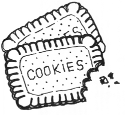

========
 Cookie
========

Cookie models an HTTP cookie used to pass data between the server and brower as defined by the original Netscape cookie specification and `RFC 2109 <http://tools.ietf.org/html/rfc2109.html>`_. Note the newer RFC 2965 is unsupported by most browsers, and even 2109 isn’t really supported by some of the major browsers.

Since only strict subset of ASCII is allowed in http headers, spectre encodes/decodes cookie values automatically using following scheme:

* chars ``0x00..0x20``, ``0x7e..0xff``, ``';'`` and ``','`` are encoded as ``\xff``, where ``ff`` stands for two-digit character’s hex code;
* chars ``0x0100..0xffff`` are encoded as ``\uffff``, where ``ffff`` stands for four-digit character’s hex code;
* ``"`` and ``\`` are backslash-escaped as ``\"`` and ``\\``, respectively.

This encoding will be absolutely transparent for you on server side, but you’ll have to deal with it by yourself on the client.

See also :attr:`Req.cookies` and :func:`Res.setCookie`.

.. class:: Cookie
   
   .. attribute:: name
   
      :class:`Str`. Name of the cookie.
   
   .. attribute:: val
   
      :class:`Str`. Value string of the cookie (raw, not encoded).
      
   .. attribute:: maxAge
   
      :class:`Duration?`. Lifetime of this cookie. After ``max-age`` elapses, the client should discard the cookie. Note that many browsers still don’t recognize ``max-age``, so setting ``max-age`` also always includes an ``expires`` attribute.
      
      If :attr:`maxAge` is ``null`` (the default) then the cookie persists until the client is shutdown.
      
      If zero is specified, the cookie is discarded immediately.
      
   .. attribute:: domain
  
      :class:`Str?`. Domain for which the cookie is valid. An explicit domain must always start with a dot.  
      
      If ``null`` (the default) then the cookie only applies to the server which set it.
      
   .. attribute:: path
   
      :class:`Str?`. Subset of URLs to which the cookie applies. If set to ``"/"`` (the default), then the cookie applies to all paths.
      
      If the path is ``null``, it is assumed to be the same path as the document being described by the header which contains the cookie.
      
   .. attribute:: secure
   
      :class:`Bool`. If ``true``, then the client only sends this cookie using a secure protocol such as HTTPS. Defaults to ``false``.