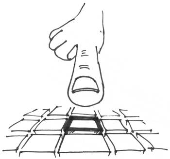

=================
 Getting started
=================

Once you have Spectre installed, use::

    >>> spectre startapp <appname>
    
to create an application stub. For example, let’s create ``getting_started`` app. Type in command prompt::

    >>> spectre startapp getting_started

You’ll see a folder was created::

  getting_started/
    fan/
    static/
    templates/    
    build.fan

Test you app by starting development server::

    >>> spectre rundevserver getting_started

and pointing browser at `<http://localhost:8080/>`_. You should see Spectre stub page. Let’s see how it works.

The only thing mandatory in stub app is the ``build.fan`` file, it must exists in the root folder of your app. Anything else may be changed to better fit your needs. In ``build.fan`` you can see a dependency on Spectre specified::
    
    using build
    class Build : build::BuildPod {
      new make() {
        podName = "getting_started"
        summary = ""
        srcDirs = [`fan/`]
        depends = ["sys 1.0", "spectre 0.8+"]
      }
    }

In ``fan/app.fan`` you’ll see a root application’s class::

  using spectre

  class Getting_startedApp : Settings {
    new make(Str:Obj? params) : super(params) {
      ...
    }  
  }
  
You’ll need one and only one :class:`Settings` implementation in your app, it will be used as a root of your application. For application to work, you set :attr:`Settings.root` property to the root :class:`Turtle` of your application.

You also should see a couple of routes specified. Routes are specified by creating :class:`Router` class and passing a list of ``[route path, view method]`` tuples to it. Let’s change it a little::

  using spectre

  class Getting_startedApp : Settings {
    new make(Str:Obj? params) : super() {
      routes = Router {
        ["/", IndexView#index],
      }
    }
  }

Our route still points at an unimplemented class method (view). To implement it, we just create a class with ``index`` method returning :class:`Res`::

  class IndexView {
    Res index() {
      return Res("<html><body><h1>Hello from the other world!</h1>"
      + "<a href='/items/'>List of items</a></body></html>")
    }
  }

If you refresh `<http://localhost:8080/>`_ in browser, you should see your hello message. Relax, take a cup of coffee, take a deep breath. We’re just in the beginning.

What we’ve done is the simplest possible way to implement view: just return :class:`Res` instance with all the content of html page. However, we are not using any power of templates at all. Let’s fix that in :class:`ItemsView`::

  class ItemsView {
    [Str:Obj][] items() {
      [["id": 1, "name": "Item 1"],
       ["id": 2, "name": "Item 2"],
       ["id": 3, "name": "Item 3"]]
    }
  
    TemplateRes list() {
      return TemplateRes("items_list.html", ["items": items])
    }
  }
  
By returning :class:`TemplateRes`, we are sending data obtained in view (``items``) to be rendered in :attr:`~TemplateRes.template` ``items_list.html`` with :attr:`~TemplateRes.context` ``["items": items]``. Let’s create ``items_list.html`` template in ``templates`` folder::

  <html>
    <head><meta http-equiv="Content-Type"
                content="text/html; charset=utf-8" /></head>
    <body>
      <h1>Items:</h1>
      <ul>
        {{#items}}
          <li><a href="/items/{{id}}/">{{name}}</a></li>
        {{/items}}
      </ul>
    
        
      <a href="/">← Return to main page</a>
    </body>
  </html>

Syntax used here is the Mustache template language. You can find a really short introduction to Musatche syntax `on their website <http://mustache.github.com/mustache.5.html>`_.

For this template to work, we should set up template renderer, in our case it will be :class:`MustacheRenderer` class. After that, :class:`TemplateRes` will then be properly intercepted by it and rendered to the proper HTML. Add this to :class:`Getting_startedApp` constructor::

  renderer = MustacheRenderer([appDir + `templates/`])

And don’t forget to add a route to our brand-new :class:`ItemsView` class::

  routes = Router {
    ["/", IndexView#index],
    ["/items/", ItemsView#list],
  }

Switch back to your browser, find a link on the index page and click it. You should be redirected to view we’ve just implemented. Have you noticed that without restarting the server you still could see new changes? That’s a feature, not a bug (see :doc:`devserver` for more details. You also will find out how to put static files into your project — css, js, images. This can make your app much prettier).

But we’re not using any request parameters yet. Let’s fix it by creating a page for individual item. Add a method to :class:`ItemsView`::

  TemplateRes edit(Str itemId) {
    Int _itemId := Int.fromStr(itemId)
    item := items.find { it["id"] as Int == _itemId }
  
    return TemplateRes("item_edit.html", ["id":   item["id"],
                                          "name": item["name"]])
  }

now add a route::

  routes = Router {
    ...
    ["/items/{itemId}/", ItemsView#edit],
  }

``itemId`` parameter will be captured in url and passed to your view as an :class:`Str` argument with the same name. Finally you create a template::
  
  <html> 
    <head><meta http-equiv="Content-Type"
                content="text/html; charset=utf-8" /></head>
    <body>
      <h1>{{name}}</h1>

      <form action="." method="POST">
        <table>
          <tr>
            <td>Id:</td><td>{{id}}</td>
          </tr>
          <tr>
            <td>Name:</td>
            <td><input type="text" name="name" value="{{name}}"/></td>
          </tr>
          <tr>
            <td></td>
            <td>
              
{{message}}

              <input type="submit" value="Save changes"/>
            </td>
          </tr>
        </table>
      </form>
        
      <a href="/items">← Return to items</a>
    </body>
  </html>
  
Now on `<http://localhost:8080/items/1/>`_ you should see a form, but the button doesn’t work. Let’s change our view a little::

  // Warning! Not safe for real-world use with concurrent website access.
  static const Unsafe itemsUnsafe := Unsafe(
    [["id": 1, "name": "Item 1"],
     ["id": 2, "name": "Item 2"],
     ["id": 3, "name": "Item 3"]])
  [Str:Obj][] items() { itemsUnsafe.val }

  TemplateRes edit(Str itemId, Req req) {
    Int _itemId := Int.fromStr(itemId)
    item := items.find { it["id"] as Int == _itemId }
  
    Str message := ""
  
    if (req.method == "POST") {
      item["name"] = req.post["name"]
      message = "Item ’" + item["name"] + "’ saved"
    }

    return TemplateRes("item_edit.html", ["id":      item["id"], 
                                          "name":    item["name"],
                                          "message": message])
  }

Here we detect form posting via :attr:`Req.method` attribute, and then access form data through :attr:`Req.post` which is a map-like object containing all POST parameters.

We’ve changed items to be stored in the static array (only one instance for app) using :class:`Unsafe`. As you can get from the name, it’s not safe for multi-threaded environment, but ok for our single-user demo. “Save changes” button should work now. Of course, changes won’t persist across application restart, but hey, it’s just a demo. You should get the general idea.

Last thing is missing: we should redirect back to page using GET after processing POST request to avoid form reposting on page refresh. Let’s see how we can do this::

  Res edit(Str itemId, Req req) {
    Int _itemId := Int.fromStr(itemId)
    item := items.find { it["id"] as Int == _itemId }
  
    if (req.method == "POST") {
      item["name"] = req.post["name"]
      Str message := "Item ’" + item["name"] + "’ saved"
      return ResRedirect(Uri.fromStr("/items/" + item["id"]
                                   + "/?message=" + Util.urlencode(message)))
    }

    Str message := req.get.get("message", "")

    return TemplateRes("item_edit.html", ["id":      item["id"],
                                          "name":    item["name"],
                                          "message": message])
  }
  
Here we just return :class:`ResRedirect` from view that will issue 302 FOUND http redirect. We also :func:`~Util.encode` message value, so if it contains any of ``&``, ``=`` or ``;`` characters they will be backslash-escaped.

Congratulations! You’ve just completed this tutorial and should have basic undestanding of how to build applications with Spectre. You may now continue by reading :doc:`turtles` to get a deeper understanding of how these things actually work. Wish you good luck!

.. note::

   Full source code of this tutorial can be found in ``examples/getting_started`` dir inside Spectre distribution.